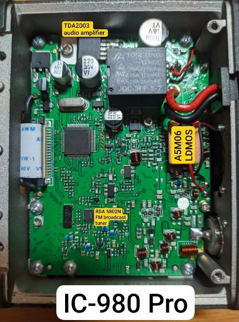

# Reverse Engineering: Hiroyasu IC-980 Pro VHF/UHF

## Introduction
This repository documents the reverse engineering process applied to the **Hiroyasu IC-980 Pro VHF/UHF** amateur radio, purchased from AliExpress.

The main objective is to analyze the hardware and firmware of the radio to understand its operation, identify possible improvements, and, if feasible, modify its software to expand its functionalities.

### Components
- STM32F101/103
- BoyaMicro 25D16AS
- TDA2003 Audio Amplifier
- 
### Binaries
- BY25D16AS@40SOP8-208.BIN : Memory dump from backside SPI flash.

## Objectives

The main objectives of this project are:

1. Extract and analyze the radio's firmware.
2. Document the hardware and its operation.
3. Explore possible improvements in the radio's configuration and operation.

